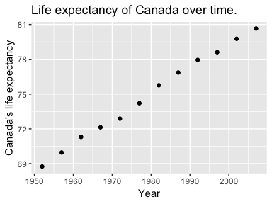
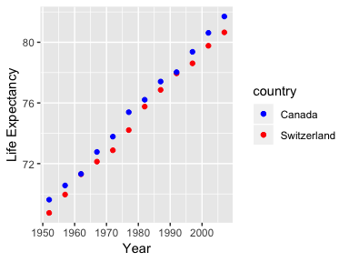

Assignment 04
================
Figali Taho
09 Oct 2018

-   [Tidy data and joins!](#tidy-data-and-joins)
    -   [Data Reshaping Prompt](#data-reshaping-prompt)
    -   [Join Prompt (join, merge, look up)](#join-prompt-join-merge-look-up)

Tidy data and joins!
--------------------

For this assignment, I will work with the Gapminder dataset again.

### Data Reshaping Prompt

In this prompt I have chosen Activity \#2:

\[x\] Make a tibble with one row per year and columns for life expectancy for two or more countries. Use knitr::kable() to make this table look pretty in your rendered homework. - I will explore the life expectancy of Canada and Switzerland.

``` r
filteredCanSwiss <- gapminder %>%
  filter(country %in% c("Canada", "Switzerland")) %>%
  select(year, country, lifeExp)
lifeExpPerYear_CanadaVsSwiss <- spread(filteredCanSwiss, country, lifeExp)
```

We have now brought the data to the required state, where there is one line per year, and Canada's and Switzerland's life expectancy as columns:

``` r
knitr::kable(lifeExpPerYear_CanadaVsSwiss)
```

|  year|  Canada|  Switzerland|
|-----:|-------:|------------:|
|  1952|  68.750|       69.620|
|  1957|  69.960|       70.560|
|  1962|  71.300|       71.320|
|  1967|  72.130|       72.770|
|  1972|  72.880|       73.780|
|  1977|  74.210|       75.390|
|  1982|  75.760|       76.210|
|  1987|  76.860|       77.410|
|  1992|  77.950|       78.030|
|  1997|  78.610|       79.370|
|  2002|  79.770|       80.620|
|  2007|  80.653|       81.701|

\[x\] Take advantage of this new data shape to scatterplot life expectancy for one country against that of another. To scatterplot the data for Canada for example, we would do something on these terms:

``` r
ggplot(lifeExpPerYear_CanadaVsSwiss, aes(x=year, y=Canada)) +
  labs(title = "Life expectancy of Canada over time.") +
  labs(x = "Year") + 
  labs(y = "Canada's life expectancy") +
  geom_point()
```



The advantage of this approach lies in the fact that now we have the data in a readily and easily servable state for comparison with one another, and we can "combine" the two plots together to better see the underlying trends.

``` r
ggplot(lifeExpPerYear_CanadaVsSwiss, aes(year)) +
  geom_point(aes(y=Canada, color='red')) +
  geom_point(aes(y=Switzerland, color='blue')) + 
  labs(x = "Year") + 
  labs(y = "Life Expectancy") +
  scale_colour_manual(name = 'country',
                      values =c('red'='red','blue'='blue'), 
                      labels = c('Canada','Switzerland'))
```



In this case, it's very easily and clearly visible that Switzerland has a higher life expectancy than Canada over the years.

### Join Prompt (join, merge, look up)

In this prompt I have chosen Activity \#1:

\[x\] Create a second data frame, complementary to Gapminder. Join this with (part of) Gapminder using a dplyr join function and make some observations about the process and result. Explore the different types of joins. Examples of a second data frame you could build: \[x\] One row per country, a country variable and one or more variables with extra info, such as language spoken, NATO membership, national animal, or capitol city. \[x\] One row per continent, a continent variable and one or more variables with extra info, such as northern versus southern hemisphere.

Lets get a VERY QUICK feel of the gapminder dataset.

``` r
knitr::kable(head(gapminder))
```

| country       | continent    |     year|     lifeExp|          pop|                            gdpPercap|
|:--------------|:-------------|--------:|-----------:|------------:|------------------------------------:|
| Afghanistan   | Asia         |     1952|      28.801|      8425333|                             779.4453|
| Afghanistan   | Asia         |     1957|      30.332|      9240934|                             820.8530|
| Afghanistan   | Asia         |     1962|      31.997|     10267083|                             853.1007|
| Afghanistan   | Asia         |     1967|      34.020|     11537966|                             836.1971|
| Afghanistan   | Asia         |     1972|      36.088|     13079460|                             739.9811|
| Afghanistan   | Asia         |     1977|      38.438|     14880372|                             786.1134|
| And now let's | check what c |  ontinen|  ts there a|  re in gapmi|  nder, so our joins aren't far off..|

``` r
knitr::kable(unique(gapminder$continent))
```

| x        |
|:---------|
| Asia     |
| Europe   |
| Africa   |
| Americas |
| Oceania  |

I'll go ahead and build a super simple (and kind of proof of concept only) dataframe that has a row per continent, a variable about number of countries for that continent and another variable for whether it is in northern or southern hemisphere.

``` r
continentExtraInfo <- tribble( ~continent, ~noCountries, ~hemisphere, 
                               "Asia", 48, "North",
                               "Europe", 44, "North",
                               "Africa", 54, "South",
                               "Americas", 55, "North",
                               "Oceania", 14, "South")
```

I could have alternatively built a csv file and read it into a dataframe, but due to the small data I avoided that approach, and use a nice tribble that makes more sense for such small data.

Let's now join the tibbles using these four mutating functions: `left_join`, `right_join`, `inner_join` and `full_join`.

``` r
knitr::kable(head(left_join(gapminder, continentExtraInfo, by = "continent")))
```

    ## Warning: Column `continent` joining factor and character vector, coercing
    ## into character vector

| country     | continent |  year|  lifeExp|       pop|  gdpPercap|  noCountries| hemisphere |
|:------------|:----------|-----:|--------:|---------:|----------:|------------:|:-----------|
| Afghanistan | Asia      |  1952|   28.801|   8425333|   779.4453|           48| North      |
| Afghanistan | Asia      |  1957|   30.332|   9240934|   820.8530|           48| North      |
| Afghanistan | Asia      |  1962|   31.997|  10267083|   853.1007|           48| North      |
| Afghanistan | Asia      |  1967|   34.020|  11537966|   836.1971|           48| North      |
| Afghanistan | Asia      |  1972|   36.088|  13079460|   739.9811|           48| North      |
| Afghanistan | Asia      |  1977|   38.438|  14880372|   786.1134|           48| North      |

As we can see, the (not so informative) columns were added to the result due to the left join based on continent name. To understand that this is working as intended, I will try leaving out `Asia` from my tribble and check that the left join produces undefined result for this continent's `noCountries` and `hemisphere`.

``` r
continentMissingExtraInfo <- tribble( ~continent, ~noCountries, ~hemisphere, 
                               "Europe", 44, "North",
                               "Africa", 54, "South",
                               "Americas", 55, "North",
                               "Oceania", 14, "South") # No Asia row.

knitr::kable(head(left_join(gapminder, continentMissingExtraInfo, by = "continent")))
```

    ## Warning: Column `continent` joining factor and character vector, coercing
    ## into character vector

| country     | continent |  year|  lifeExp|       pop|  gdpPercap|  noCountries| hemisphere |
|:------------|:----------|-----:|--------:|---------:|----------:|------------:|:-----------|
| Afghanistan | Asia      |  1952|   28.801|   8425333|   779.4453|           NA| NA         |
| Afghanistan | Asia      |  1957|   30.332|   9240934|   820.8530|           NA| NA         |
| Afghanistan | Asia      |  1962|   31.997|  10267083|   853.1007|           NA| NA         |
| Afghanistan | Asia      |  1967|   34.020|  11537966|   836.1971|           NA| NA         |
| Afghanistan | Asia      |  1972|   36.088|  13079460|   739.9811|           NA| NA         |
| Afghanistan | Asia      |  1977|   38.438|  14880372|   786.1134|           NA| NA         |

As seen above, this produces desired result.

Using the latter values, and plotting the `right_join` produces a result whereby Asia is ommited, since it is not present in the `continentMissingExtraInfo` variable.

``` r
knitr::kable(head(right_join(gapminder, continentMissingExtraInfo, by = "continent")))
```

    ## Warning: Column `continent` joining factor and character vector, coercing
    ## into character vector

| country | continent |  year|  lifeExp|      pop|  gdpPercap|  noCountries| hemisphere |
|:--------|:----------|-----:|--------:|--------:|----------:|------------:|:-----------|
| Albania | Europe    |  1952|    55.23|  1282697|   1601.056|           44| North      |
| Albania | Europe    |  1957|    59.28|  1476505|   1942.284|           44| North      |
| Albania | Europe    |  1962|    64.82|  1728137|   2312.889|           44| North      |
| Albania | Europe    |  1967|    66.22|  1984060|   2760.197|           44| North      |
| Albania | Europe    |  1972|    67.69|  2263554|   3313.422|           44| North      |
| Albania | Europe    |  1977|    68.93|  2509048|   3533.004|           44| North      |

Using the normal tribble should not omit Asia from the result:

``` r
knitr::kable(head(right_join(gapminder, continentExtraInfo, by = "continent")))
```

    ## Warning: Column `continent` joining factor and character vector, coercing
    ## into character vector

| country     | continent |  year|  lifeExp|       pop|  gdpPercap|  noCountries| hemisphere |
|:------------|:----------|-----:|--------:|---------:|----------:|------------:|:-----------|
| Afghanistan | Asia      |  1952|   28.801|   8425333|   779.4453|           48| North      |
| Afghanistan | Asia      |  1957|   30.332|   9240934|   820.8530|           48| North      |
| Afghanistan | Asia      |  1962|   31.997|  10267083|   853.1007|           48| North      |
| Afghanistan | Asia      |  1967|   34.020|  11537966|   836.1971|           48| North      |
| Afghanistan | Asia      |  1972|   36.088|  13079460|   739.9811|           48| North      |
| Afghanistan | Asia      |  1977|   38.438|  14880372|   786.1134|           48| North      |

Inner join should be interesting. Let's demonstrate it by only including `Oceania` in a new custom extra information tribble

``` r
oceaniaExtraInfo <-  tribble( ~continent, ~noCountries, ~hemisphere, 
                              "Oceania", 14, "South") # Only Oceania
knitr::kable(head(inner_join(gapminder, oceaniaExtraInfo, by = "continent")))
```

    ## Warning: Column `continent` joining factor and character vector, coercing
    ## into character vector

| country   | continent |  year|  lifeExp|       pop|  gdpPercap|  noCountries| hemisphere |
|:----------|:----------|-----:|--------:|---------:|----------:|------------:|:-----------|
| Australia | Oceania   |  1952|    69.12|   8691212|   10039.60|           14| South      |
| Australia | Oceania   |  1957|    70.33|   9712569|   10949.65|           14| South      |
| Australia | Oceania   |  1962|    70.93|  10794968|   12217.23|           14| South      |
| Australia | Oceania   |  1967|    71.10|  11872264|   14526.12|           14| South      |
| Australia | Oceania   |  1972|    71.93|  13177000|   16788.63|           14| South      |
| Australia | Oceania   |  1977|    73.49|  14074100|   18334.20|           14| South      |

The above produces an intersection of the dataframes, whereby only the `Oceania` continent information, joined with the new information for this continent, was produced.

A full join using the above created tribble should also be interesting, as it should produce a lot of n/a values for our newly added columns. Let's see:

``` r
knitr::kable(head(full_join(gapminder, oceaniaExtraInfo, by = "continent")))
```

    ## Warning: Column `continent` joining factor and character vector, coercing
    ## into character vector

| country     | continent |  year|  lifeExp|       pop|  gdpPercap|  noCountries| hemisphere |
|:------------|:----------|-----:|--------:|---------:|----------:|------------:|:-----------|
| Afghanistan | Asia      |  1952|   28.801|   8425333|   779.4453|           NA| NA         |
| Afghanistan | Asia      |  1957|   30.332|   9240934|   820.8530|           NA| NA         |
| Afghanistan | Asia      |  1962|   31.997|  10267083|   853.1007|           NA| NA         |
| Afghanistan | Asia      |  1967|   34.020|  11537966|   836.1971|           NA| NA         |
| Afghanistan | Asia      |  1972|   36.088|  13079460|   739.9811|           NA| NA         |
| Afghanistan | Asia      |  1977|   38.438|  14880372|   786.1134|           NA| NA         |

Thanks for reading my homework! Enjoy your day :smile:
